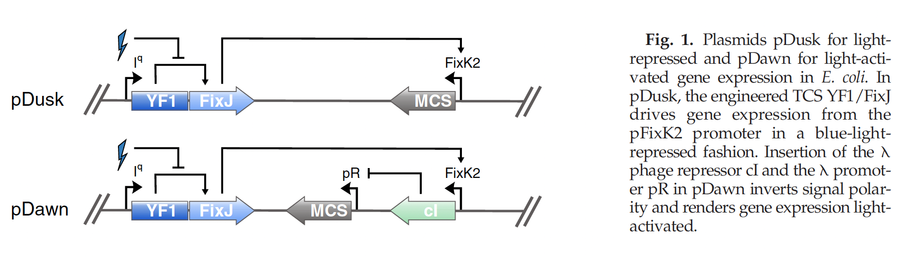

# Wet Lab

## Violacein AND gate
The original design for the AND gate was to use an igem part T7 polymerase AND gate (BBa_K568004). However this part along with the Vio operon would result a part that is almost 15kb. Our PI noted us of the difficulties of transforming a part of such size an suggested a different AND gate design. His AND gate design was a split vio operon which had few vio genes under control of one promoter and the rest of the genes under the control of a different promoter. Thus, the full violacein pathway is constituted only when both of the promoters are activated. 
As described in the Description page, we decided to use light as one of the inputs for violacein production. For the second input, for simplification and reliability, the IPTG inducible lac promoter was used. 
Gibson assembly was used to connect two addgene plasmids: 
[Violacein `addgene' vector](https://www.addgene.org/73440/)

[Violacein `addgene' vector](https://www.addgene.org/43796/)
 
The final construct is as follows. 

Though it would be the best to include the full violacein pathway, the gibson process would be a lot more complicated. Thus, our PI suggested a proof of concept plasmid which has vioA under the control of pDawn system and vioB and vioE under the control of the IPTG inducible system. 

Due to time constraints and the fact that there were no experienced wet lab member in our team, our wet lab instructors Sera Kang and Xiaoyue conducted the assembly and transformation proccess. 

The protocols for the experiments can be seen below.

#### Experiment 3-3 Design

<!---
* signal 1: light ([`pDawn`](https://www.sciencedirect.com/science/article/pii/S0022283612000113)) induces `vioAB` genes
--->

* singal 1 & 2: light ([`pDawn`](https://www.sciencedirect.com/science/article/pii/S0022283612000113)) induces `vioA` genes from ([`addgene` vector](https://www.addgene.org/73440/)) 

#### Kill switch design
* MazE (toxin), MazF (anti-toxin)을 이용
* AND gate (3-3) output (MazE) overexpression (일종의 inverter로 출력신호가 참인경우 궁긍적으로 kill)

Final design: https://benchling.com/s/seq-6qhcqiyf7aGrzehEtqXO

## Cell counting protocols
[Cell counting.pdf](https://github.com/KUAS-Korea/KUAS-2021-igem/files/7158512/Cell.counting.pdf)

