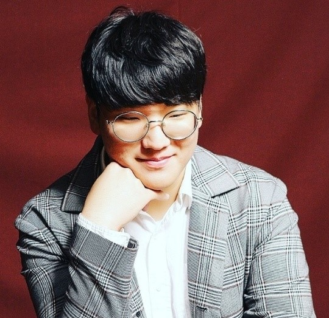

# JunSung Park 박준성

## Bio
* Major: Biology
* Personal Interests: Synthetic biology, Neuroscience, Ecology etc.
---

## Role
* 2021 wet lab member
* researcher (2021)
---

## Activity

* Participate in planning and producing promotion videos.
* Researching about phylogeny of mub protein, Bd infection process and pathology related in MHC2.
* Suggesting mathematical model of BD infection.

## Links
* https://junsungpark-lab.github.io/AboutMe/index.html

